# BUILD

[toc]

-----


## rocker/binder

https://hub.docker.com/r/rocker/binder/dockerfile

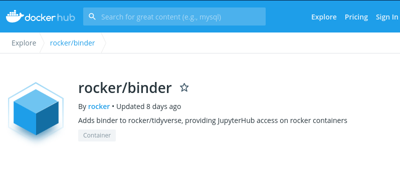

### Dockerfile

```ruby
FROM rocker/geospatial:3.6.3

ENV NB_USER rstudio
ENV NB_UID 1000
ENV VENV_DIR /srv/venv

# Set ENV for all programs...
ENV PATH ${VENV_DIR}/bin:$PATH
# And set ENV for R! It doesn't read from the environment...
RUN echo "PATH=${PATH}" >> /usr/local/lib/R/etc/Renviron
RUN echo "export PATH=${PATH}" >> ${HOME}/.profile

# The `rsession` binary that is called by nbrsessionproxy to start R doesn't seem to start
# without this being explicitly set
ENV LD_LIBRARY_PATH /usr/local/lib/R/lib

ENV HOME /home/${NB_USER}
WORKDIR ${HOME}

RUN apt-get update && \
    apt-get -y install python3-venv python3-dev && \
    apt-get purge && \
    apt-get clean && \
    rm -rf /var/lib/apt/lists/*

# Create a venv dir owned by unprivileged user & set up notebook in it
# This allows non-root to install python libraries if required
RUN mkdir -p ${VENV_DIR} && chown -R ${NB_USER} ${VENV_DIR}

USER ${NB_USER}
RUN python3 -m venv ${VENV_DIR} && \
    # Explicitly install a new enough version of pip
    pip3 install pip==9.0.1 && \
    pip3 install --no-cache-dir \
         jupyter-rsession-proxy

RUN R --quiet -e "devtools::install_github('IRkernel/IRkernel')" && \
    R --quiet -e "IRkernel::installspec(prefix='${VENV_DIR}')"


CMD jupyter notebook --ip 0.0.0.0


## If extending this image, remember to switch back to USER root to apt-get
```


### install.R (packages)

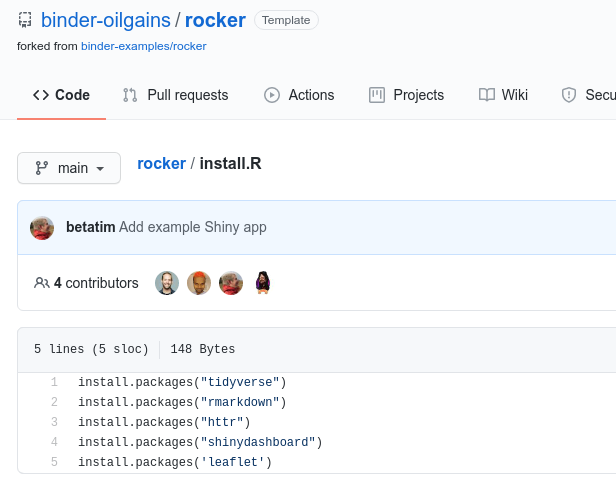

## R-3.6.3


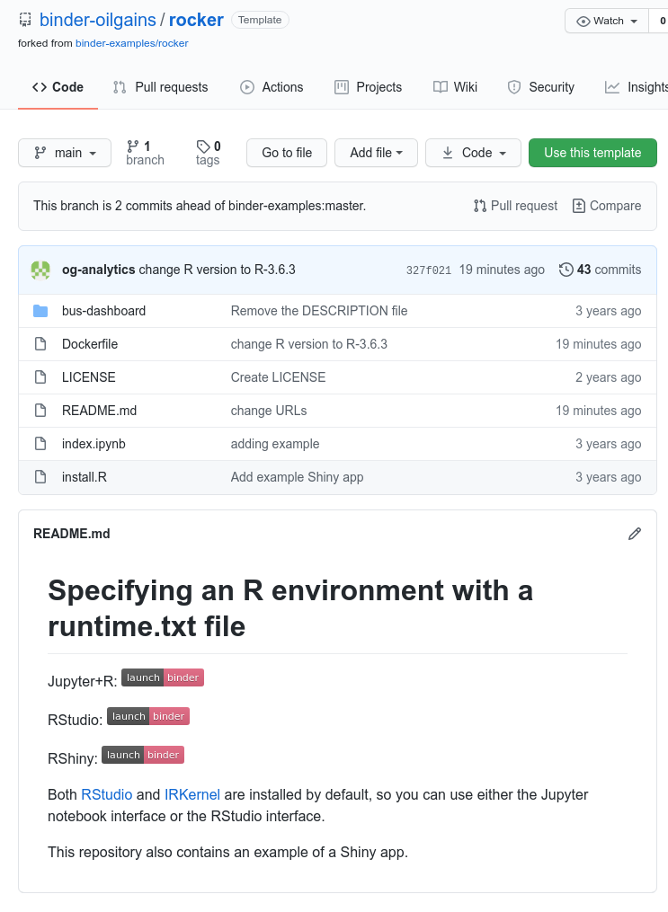


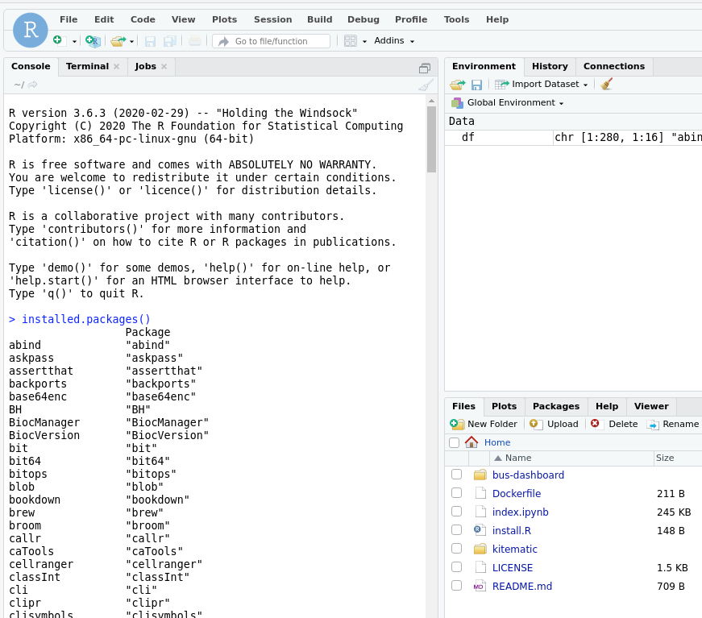


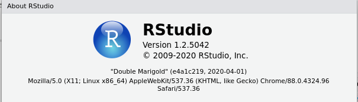


## R-3.5.3

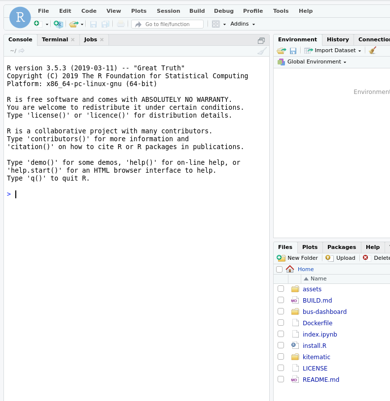


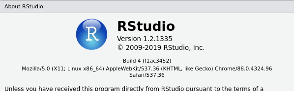


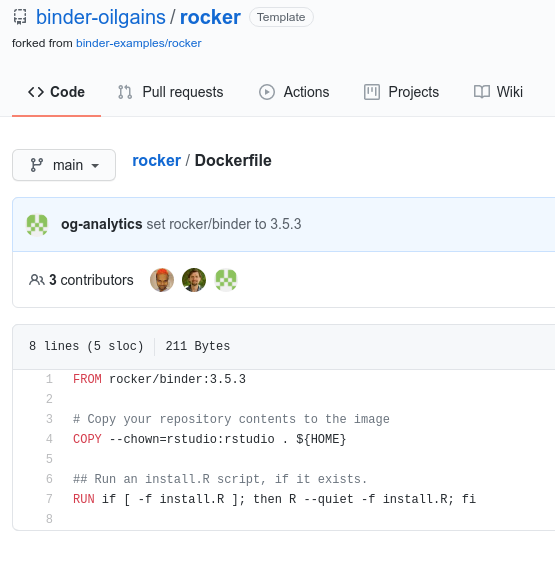


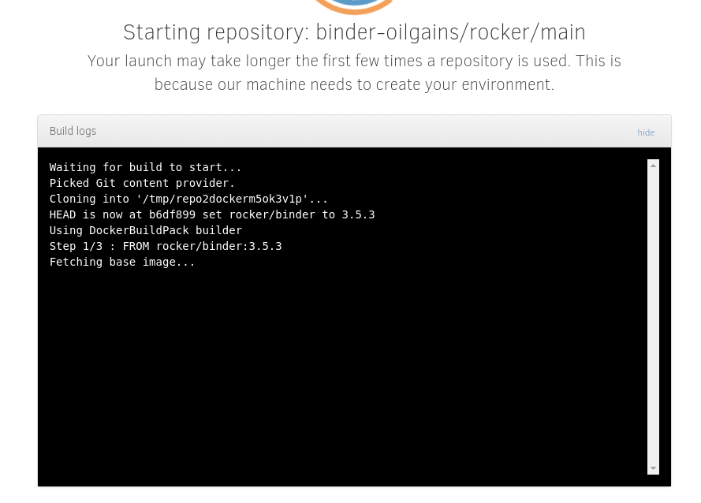


## R-3.5.1

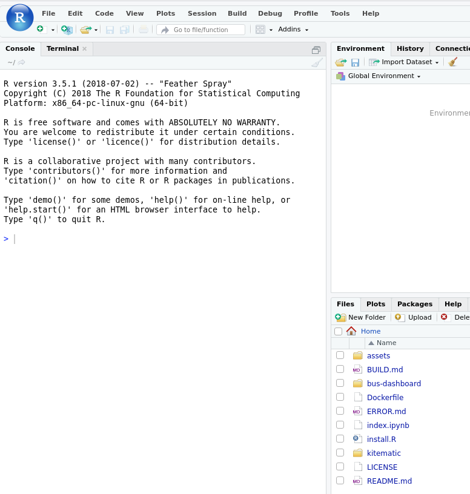


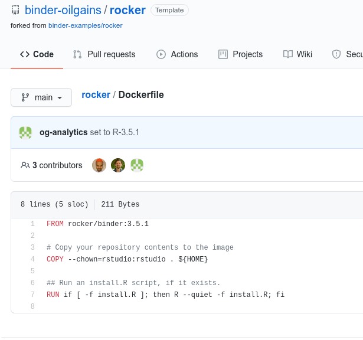


## rocker/binder

https://hub.docker.com/r/rocker/binder/dockerfile

```ruby
FROM rocker/geospatial:3.6.3

ENV NB_USER rstudio
ENV NB_UID 1000
ENV VENV_DIR /srv/venv

# Set ENV for all programs...
ENV PATH ${VENV_DIR}/bin:$PATH
# And set ENV for R! It doesn't read from the environment...
RUN echo "PATH=${PATH}" >> /usr/local/lib/R/etc/Renviron
RUN echo "export PATH=${PATH}" >> ${HOME}/.profile

# The `rsession` binary that is called by nbrsessionproxy to start R doesn't seem to start
# without this being explicitly set
ENV LD_LIBRARY_PATH /usr/local/lib/R/lib

ENV HOME /home/${NB_USER}
WORKDIR ${HOME}

RUN apt-get update && \
    apt-get -y install python3-venv python3-dev && \
    apt-get purge && \
    apt-get clean && \
    rm -rf /var/lib/apt/lists/*

# Create a venv dir owned by unprivileged user & set up notebook in it
# This allows non-root to install python libraries if required
RUN mkdir -p ${VENV_DIR} && chown -R ${NB_USER} ${VENV_DIR}

USER ${NB_USER}
RUN python3 -m venv ${VENV_DIR} && \
    # Explicitly install a new enough version of pip
    pip3 install pip==9.0.1 && \
    pip3 install --no-cache-dir \
         jupyter-rsession-proxy

RUN R --quiet -e "devtools::install_github('IRkernel/IRkernel')" && \
    R --quiet -e "IRkernel::installspec(prefix='${VENV_DIR}')"


CMD jupyter notebook --ip 0.0.0.0


## If extending this image, remember to switch back to USER root to apt-get

```